<h1 align="center">Explore Neural Network Training Techniques</h1>

# Project Overview

# Project Structure

# File Descriptions

# <h1 align="center">Data Analysis and Preparation</h1>

## 1. Data Understanding

Initial exploration of the dataset to understand its structure, feature types, data quality aspects, and basic statistical properties. This step establishes a foundational understanding of the data before conducting further analysis, preprocessing, and model development.

### 1.1. Dataset Structure

The dataset used in this project is the **Statlog (Shuttle) dataset**, a multiclass classification dataset derived from NASA space shuttle simulations. It contains numerical measurements describing different shuttle conditions, with the goal of classifying each observation into one of several predefined classes.

🔗 [Statlog (Shuttle) Dataset - UCI Machine Learning Repository](https://archive.ics.uci.edu/dataset/148/statlog)

#### Dataset Information

| Property | Description |
|:---:|:---:|
| Number of instances | 43,500 |
| Number of features | 9 |
| Target variable | Feature 9 |
| Task type | Multiclass Classification |
| Data type | Numerical |

#### Features

The dataset contains nine numerical features representing shuttle sensor measurements. The original dataset does not provide descriptive feature names, so features are referenced by their column indices.

#### Target Variable

| Target | Description |
|:---:|:---:|
| target | Class label representing the shuttle condition |

The original Statlog Shuttle dataset represents the seven classes using labels 1–7. However, PyTorch's CrossEntropyLoss expects class labels to be zero-indexed, meaning that for seven classes the valid target values are 0–6.

Since the model produces seven output logits indexed from 0 to 6, a target value of 7 would refer to an eighth output that does not exist, resulting in an IndexError: Target 7 is out of bounds.

Therefore, the target labels are shifted by one during preprocessing:

df["target"] = df["target"] - 1

This converts the original labels from 1–7 to 0–6, making them compatible with CrossEntropyLoss.

### 1.2. Initial Statistical Insights

#### Feature Statistics

The dataset contains 43,500 observations with 9 numerical features and 1 target variable.

Some features show a wide range of values:

- Feature 2:
  - Mean = -0.21
  - Standard deviation = 78.14
  - Minimum = -4821
  - Maximum = 5075

- Feature 6:
  - Mean = 1.30
  - Standard deviation = 179.49
  - Minimum = -13839
  - Maximum = 13148

- Feature 8:
  - Mean = 50.90
  - Standard deviation = 21.46
  - Minimum = -353
  - Maximum = 270

> #### Key Findings
>
>- Several features have large differences between their minimum, maximum, and mean values, indicating possible extreme observations and the need for further investigation during exploratory data analysis.
>
>- Feature scales vary significantly across the dataset, suggesting that feature normalization or standardization may be beneficial before neural network training.
>
>- The target variable contains multiple classes, requiring multiclass classification techniques.

### 1.3. Data Quality Assessment

The dataset was evaluated for potential data quality issues before further analysis and preprocessing.

#### Missing Values

- Total missing values: 0

#### Duplicate Records

- Total duplicate rows: 0

#### Data Types

- All features are numerical (`int64`)
- No categorical encoding is required.

## 2. Exploratory Data Analysis (EDA)

Comprehensive analysis of feature distributions, relationships, and data patterns to understand underlying structures in the dataset.

### Feature 1 - Histogram

  

### Feature 1 - Boxplot

  

>**Key Observations**
>
>**Asymmetrical Distribution (Skewness):**
The histogram displays a right-skewed distribution featuring prominent density peaks around the values of **38** and **55**. From these high-frequency modes, the distribution extends into a long right tail. Because this pronounced positive skew can destabilize gradient-based optimizers during model training, a distribution transformation would be beneficial. Since the feature appears to contain strictly positive values, I recommend applying a **Log Transformation**. This approach is likely to normalize the distribution and stabilize the variance before the data is passed to my model.
>
>**Extreme Outlier Concentration:**
The boxplot indicates a dense, continuous sequence of extreme outliers starting immediately beyond the upper bound defined by $1.5 \times IQR$ (approximately **80**) and reaching up to **125**. Rather than isolated measurement anomalies, these concentrated points align with the secondary clusters visible in the histogram. Therefore, they appear to represent valid observations that I need to preserve to avoid significant information loss.
>
>**Scaling Recommendation:**
I recommend utilizing a **`RobustScaler`** for this feature. Because the data contains a heavy concentration of valid, extreme outliers, a mean-based approach like `StandardScaler` would be heavily distorted. `RobustScaler` relies on the median and the interquartile range (which sits tightly between **38** and **55**), meaning it is highly likely to scale the feature effectively without squashing the variance of my dominant baseline readings.

### Feature 2 - Histogram

  

### Feature 2 - Boxplot

  

>**Key Observations**
>
>**Asymmetrical Distribution (Skewness):**
The histogram displays an extremely peaked, zero-centered distribution with values spanning into both negative and positive domains. The vast majority of sensor readings are concentrated exactly at zero, with the distribution extending into sparse, heavy tails in both directions. Because this feature contains zero and negative values, a Log Transformation cannot be evaluated. To normalize this heavily leptokurtic distribution and stabilize the variance, I recommend applying a **Yeo-Johnson Transformation**. This approach is a suitable candidate because it safely handles negative numbers and zeros while mitigating the impact of heavy tails on my model.
>
>**Extreme Outlier Concentration:**
The boxplot indicates that the central box is entirely compressed at zero, suggesting the interquartile range (IQR) is extremely narrow or essentially zero. From this resting baseline, a sparse array of extreme outliers radiates symmetrically, extending down to approximately -4500 and up to 5000. Rather than isolated measurement errors, these extreme deviations are likely to represent valid, rare operational states that capture critical minority classes. 
>
>**Scaling Recommendation:**
I recommend utilizing a **`RobustScaler`** for this feature, assuming the underlying implementation can manage a near-zero IQR. Because the data contains massive outliers relative to the dominant zero-cluster, mean-based approaches like `StandardScaler` or boundary-based methods like `MinMaxScaler` would be heavily distorted. `RobustScaler` appears to be the most suitable candidate to handle the extreme valid observations without squashing the variance of my dominant baseline readings.

### Feature 3 - Histogram

  

### Feature 3 - Boxplot

  

>**Key Observations**
>
>**Asymmetrical Distribution (Skewness):**
The histogram displays a moderately right-skewed, multimodal distribution. The bulk of the readings are concentrated between **75** and **90**, with secondary density peaks stretching up toward 110. Because this positive skewness is likely to introduce instability into gradient-based optimizers, a distribution transformation would be beneficial. Since the feature appears to contain strictly positive values (with a minimum observation around 20), I recommend applying a **Log Transformation**. This approach is a suitable candidate to normalize the right-leaning tail and stabilize the variance before feeding the data into my model.
>
>**Extreme Outlier Concentration:**
The boxplot reveals a dense, continuous cluster of upper outliers just beyond the $1.5 \times IQR$ upper bound (between **105** and **115**), which clearly aligns with the secondary peaks in the histogram. Therefore, these appear to represent valid, discrete minority states. However, there are also a few highly isolated extreme outliers located well above the main cluster (near **140** and **150**) and far below it (between **20** and **45**). While the concentrated cluster is highly likely to be valid data, these isolated extremes might require further investigation to rule out measurement anomalies. 
>
>**Scaling Recommendation:**
I recommend utilizing a **`RobustScaler`** for this feature. The presence of both clustered and isolated extreme outliers would pull the mean and artificially inflate the standard deviation, meaning `StandardScaler` would be heavily distorted. By relying on the median and the interquartile range (which cleanly captures the central density between approximately 79 and 89), `RobustScaler` will allow me to scale the baseline data properly while preserving the critical extreme observations.

### Feature 4 - Histogram

  

### Feature 4 - Boxplot

  

>**Key Observations**
>
>**Asymmetrical Distribution (Skewness):**
The histogram reveals a highly peaked, zero-centered distribution with values extending into both the negative and positive domains. The vast majority of observations are concentrated precisely at zero, creating a symmetrical but extremely leptokurtic shape characterized by heavy tails. Because this feature clearly contains zero and negative values, a Log Transformation cannot be utilized. Instead, I recommend applying a **Yeo-Johnson Transformation**. This technique appears to be a suitable candidate for safely handling the negative values while mitigating the impact of the heavy tails and stabilizing the variance before feeding the data into my model.
>
>**Extreme Outlier Concentration:**
The boxplot illustrates that the central box (the interquartile range) is entirely compressed at zero. From this dominant baseline, a sparse array of extreme outliers radiates outward, reaching as low as approximately -4000 and as high as roughly 3900. These extreme deviations appear to be structurally consistent rather than random measurement errors, suggesting they are highly likely to represent valid, rare operational states that I need to retain for accurate minority class representation.
>
>**Scaling Recommendation:**
I recommend utilizing a **`RobustScaler`** for this feature, assuming my underlying implementation can properly manage a near-zero IQR. Because the data contains extreme outliers relative to the massive zero-cluster, mean-based approaches like `StandardScaler` would compute an artificially inflated standard deviation. `RobustScaler` appears to be the most suitable method to accommodate these valid extreme observations without severely squashing the variance of my normal baseline readings.

### Feature 5 - Histogram

  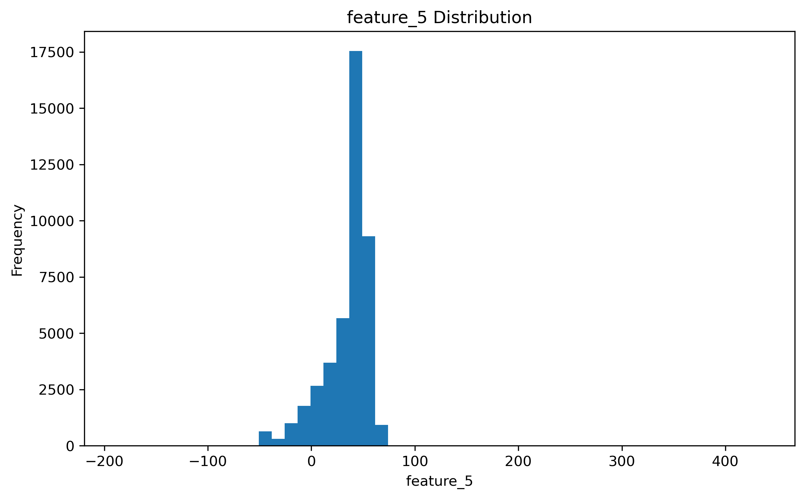

### Feature 5 - Boxplot

  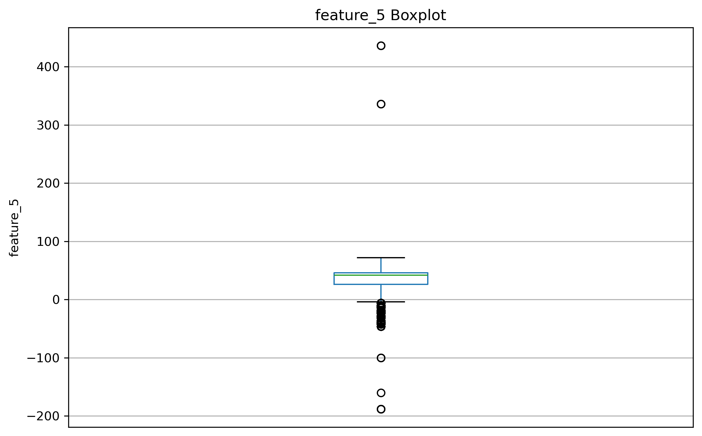

>**Key Observations**
>
>**Asymmetrical Distribution (Skewness):**
The histogram displays a left-skewed (negatively skewed) distribution, peaking sharply between the values of 40 and 60. From this dense central region, a prominent left tail extends well into negative territory. Because this pronounced asymmetry is likely to destabilize gradient-based optimizers during model training, a distribution transformation would be beneficial. Since the feature clearly contains negative values, a Log Transformation cannot be utilized. Instead, I recommend applying a **Yeo-Johnson Transformation**. This technique appears to be a suitable candidate to safely normalize the negatively skewed data and stabilize the variance before feeding it into my model.
>
>**Extreme Outlier Concentration:**
The boxplot reveals a dense concentration of lower outliers extending continuously just below the lower bound (down to roughly -50), which aligns with the visible left tail in the histogram. These clustered points appear to represent valid, critical minority class observations. Additionally, there are a few highly isolated extreme outliers located far below the main cluster (down to approximately -190) and far above it (near 330 and 430). While the denser clusters are likely valid, these extreme isolated points might require further investigation to rule out potential measurement anomalies.
>
>**Scaling Recommendation:**
I recommend utilizing a **`RobustScaler`** for this feature. The presence of extreme outliers on both ends of the distribution would heavily distort the mean and artificially inflate the standard deviation, making `StandardScaler` highly ineffective. `RobustScaler` relies on the median and the interquartile range (which cleanly captures the core baseline data between approximately 25 and 50), making it the most suitable candidate to scale the feature properly without squashing the variance of my normal readings.

### Feature 6 - Histogram

  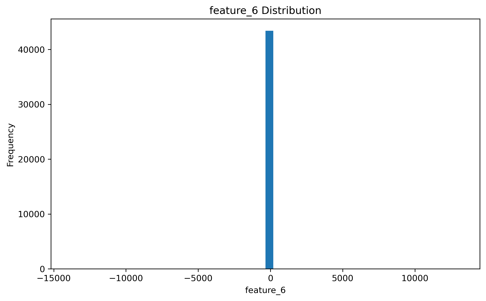

### Feature 6 - Boxplot

  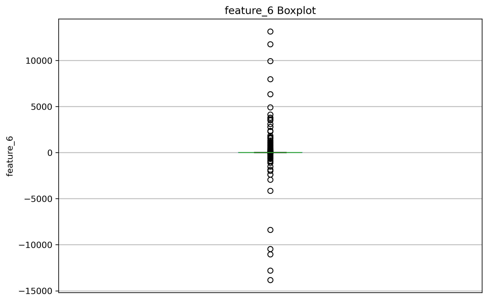

>**Key Observations**
>
>**Asymmetrical Distribution (Skewness):**
The histogram shows a heavily leptokurtic distribution entirely concentrated around a central peak at zero. The data spans a massive range across both negative and positive values, indicating very heavy tails. Because this feature contains zero and negative values, a Log Transformation is mathematically invalid. I recommend applying a **Yeo-Johnson Transformation** instead. This technique would be a suitable candidate to safely manage the extreme range of negative and positive values, normalize the distribution, and stabilize the variance for my model.
>
>**Extreme Outlier Concentration:**
The boxplot indicates that the interquartile range is completely collapsed at zero. Extending from this resting baseline is a sparse but extensive array of extreme outliers, reaching down to approximately -14,000 and up to 13,000. These extreme deviations do not appear to be random measurement noise but rather suggest highly distinct, rare operational states. Therefore, they are highly likely to represent valid minority class observations that I must retain to ensure accurate model performance.
>
>**Scaling Recommendation:**
I recommend using a **`RobustScaler`** for this feature, provided my implementation can properly handle a near-zero interquartile range. Because the outliers are so extreme in magnitude relative to the dense zero-centered baseline, `StandardScaler` would compute an artificially massive standard deviation. `RobustScaler` appears to be the most effective method to scale this feature without severely compressing the variance of my dominant baseline data.

### Feature 7 - Histogram

  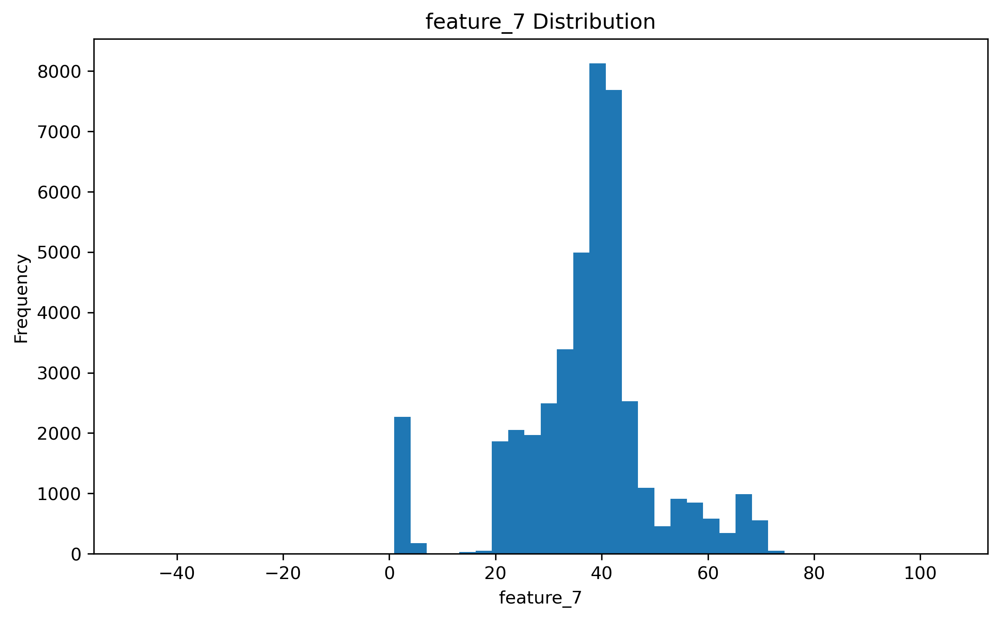

### Feature 7 - Boxplot

  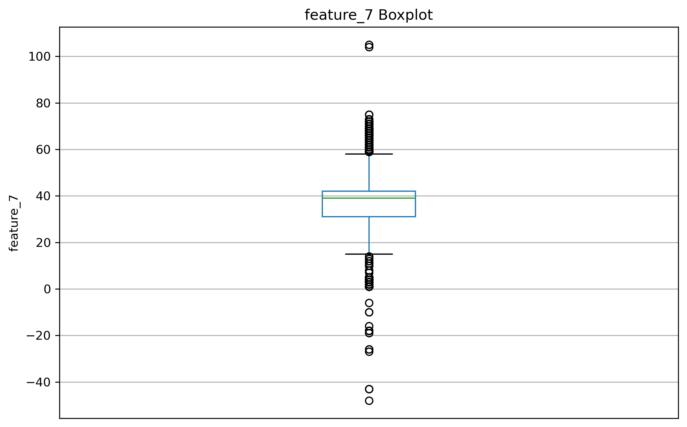

>**Key Observations**
>
>**Asymmetrical Distribution (Skewness):**
The histogram displays a complex, multimodal distribution with a dominant density peak around 40 and secondary clusters near 0 and between 50 and 70. Because this structural asymmetry can destabilize gradient-based optimizers during model training, a distribution transformation would be beneficial. Since the boxplot confirms this feature contains zero and negative values (dropping as low as roughly -48), a Log Transformation cannot be utilized. Instead, I recommend applying a **Yeo-Johnson Transformation**. This technique appears to be a suitable candidate for safely managing the negative values while normalizing the multimodal distribution and stabilizing the variance for my model.
>
>**Extreme Outlier Concentration:**
The boxplot indicates outliers on both ends of the main distribution. Upper outliers form a dense sequence from approximately 58 to 75, alongside an isolated extreme point near 105. Lower outliers are densely packed from the lower whisker down to 0, with several highly isolated points continuing down into the negative range (-10 to -48). The denser outlier clusters clearly align with the secondary peaks in the histogram, suggesting they represent valid minority class states. However, the isolated extreme points at both the absolute upper and lower bounds might require further investigation to rule out measurement anomalies.
>
>**Scaling Recommendation:**
I recommend utilizing a **`RobustScaler`** for this feature. The presence of significant outliers on both ends of the data would heavily distort the mean and artificially inflate the standard deviation, rendering `StandardScaler` ineffective. By relying on the median and the interquartile range (which safely captures the core baseline readings between approximately 30 and 42), `RobustScaler` is highly likely to scale the feature properly without squashing the variance of my normal data.

### Feature 8 - Histogram

  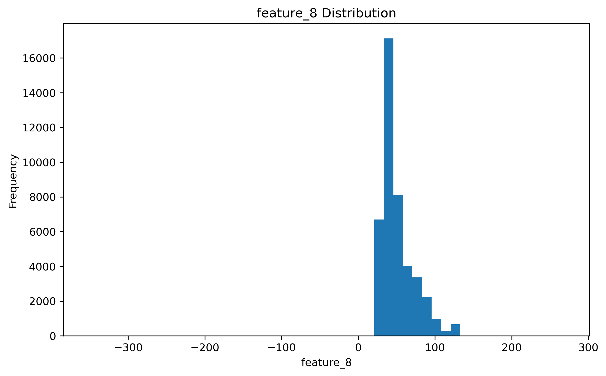

### Feature 8 - Boxplot

  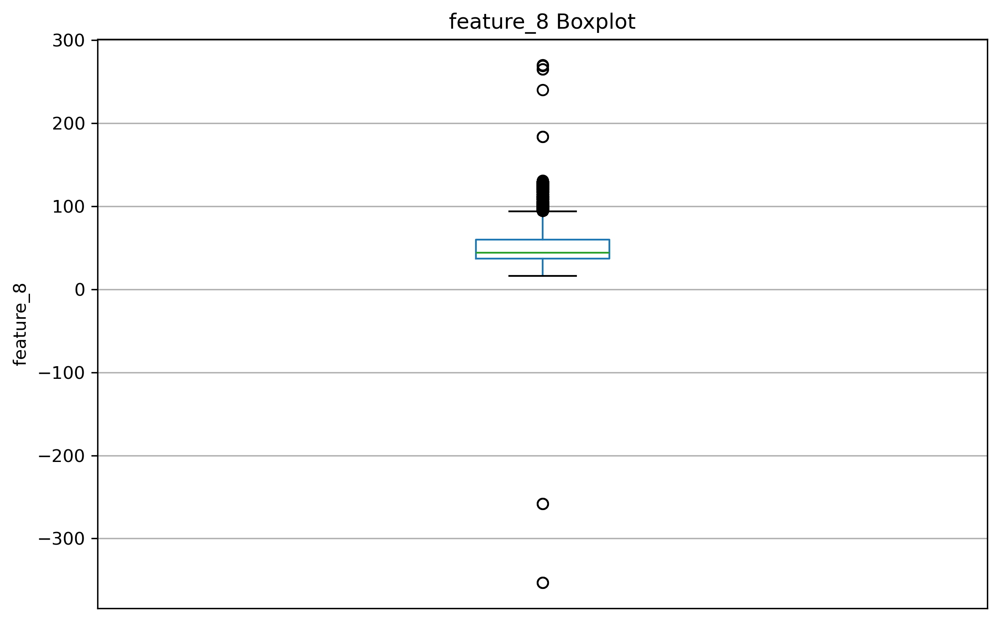

>**Key Observations**
>
>**Asymmetrical Distribution (Skewness):**
The histogram illustrates a right-skewed distribution with its primary density heavily concentrated between 30 and 60. From this central peak, the data exhibits a noticeable right-leaning tail stretching toward 140. Because this asymmetry can impede the convergence of gradient-based optimizers, a distribution transformation would be beneficial. Although the histogram predominantly displays positive values, the boxplot confirms the presence of extreme negative observations (dropping as low as -350). Consequently, a Log Transformation cannot be utilized. Instead, I recommend applying a **Yeo-Johnson Transformation**. This technique appears to be a suitable candidate to safely manage the negative values while normalizing the skewness and stabilizing the variance before feeding the data into my model.
>
>**Extreme Outlier Concentration:**
The boxplot displays a dense, continuous sequence of upper outliers starting just beyond the upper whisker (approximately 90) and continuing to 140, which aligns with the visible right tail in the histogram. These clustered points are highly likely to represent valid minority class observations. However, there are also highly isolated extreme outliers located far above the main cluster (up to roughly 280) and far below it in negative territory (near -260 and -350). While the dense upper cluster appears structurally consistent, these extremely isolated points might require further investigation to determine if they are rare but valid operational states or simply measurement anomalies.
>
>**Scaling Recommendation:**
I recommend utilizing a **`RobustScaler`** for this feature. The presence of highly isolated extreme outliers on both ends of the distribution would severely distort the arithmetic mean and artificially inflate the standard deviation, rendering `StandardScaler` ineffective. By relying on the median and the interquartile range (which cleanly captures the core baseline data between approximately 35 and 60), `RobustScaler` is highly likely to scale the feature properly without squashing the variance of my normal baseline readings.

### Feature 9 - Histogram

  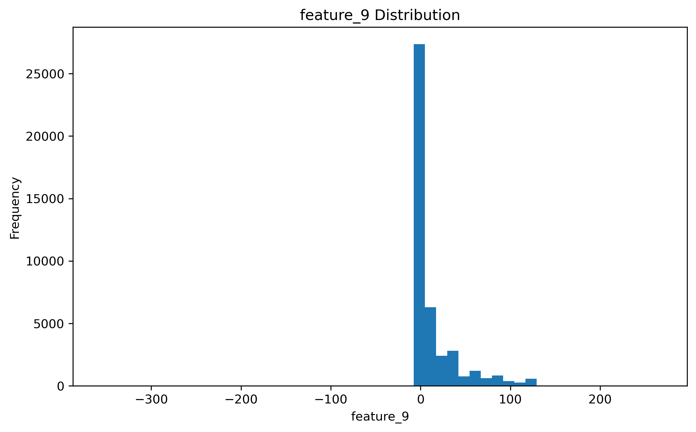

### Feature 9 - Boxplot

  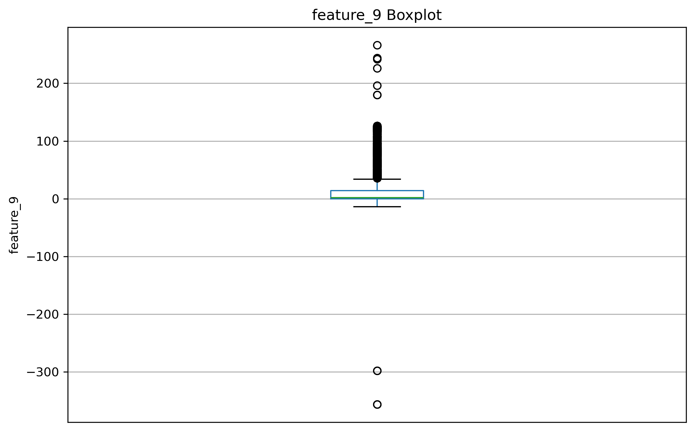

>**Key Observations**
>
>**Asymmetrical Distribution (Skewness):**
The histogram displays a heavily right-skewed distribution characterized by a massive density peak concentrated near zero, followed by a long, trailing tail extending past 100. Because this pronounced positive skew can destabilize gradient-based optimizers during model training, a distribution transformation would be beneficial. Although the histogram primarily shows positive values, the boxplot reveals the presence of extreme negative observations (dropping down to approximately -350). Consequently, a Log Transformation cannot be utilized. Instead, I recommend applying a **Yeo-Johnson Transformation**. This technique appears to be a suitable candidate to safely manage the negative values while normalizing the right-leaning skewness and stabilizing the variance before feeding the data into my model.
>
>**Extreme Outlier Concentration:**
The boxplot illustrates a dense sequence of upper outliers starting just beyond the upper whisker (around 35) and stretching up to approximately 130, which aligns with the visible right tail in the histogram. These clustered points appear to represent valid, critical minority class observations. However, there are also highly isolated extreme outliers located further up (between 180 and 260) and far down in the negative range (near -300 and -350). While the dense upper tail is likely valid data, these extremely isolated points might require further investigation to rule out potential measurement anomalies.
>
>**Scaling Recommendation:**
I recommend utilizing a **`RobustScaler`** for this feature. The presence of extreme outliers on both ends of the distribution would heavily distort the arithmetic mean and artificially inflate the standard deviation, rendering `StandardScaler` ineffective. By relying on the median and the interquartile range (which tightly captures the core baseline density around zero), `RobustScaler` is highly likely to scale the feature properly without squashing the variance of my normal baseline readings.

### Preprocessing Strategy Overview

| Feature | Distribution Type | Recommended Transformation | Recommended Scaler | Key Rationale Summary |
| :--- | :--- | :--- | :--- | :--- |
| **Feature 1** | Right-Skewed (Positive) | Log Transformation | `RobustScaler` | Normalizes positive right tail; robust to dense valid upper outliers. |
| **Feature 2** | Leptokurtic (Zero-Centered) | Yeo-Johnson | `RobustScaler` | Handles zero/negative values safely; protects against extreme scale distortion. |
| **Feature 3** | Multimodal / Right-Skewed | Log Transformation | `RobustScaler` | Tames right-leaning tail; avoids standard deviation inflation from outliers. |
| **Feature 4** | Leptokurtic (Zero-Centered) | Yeo-Johnson | `RobustScaler` | Safely handles negative/zero bounds; protects normal baseline variance. |
| **Feature 5** | Left-Skewed (Negative Tail) | Yeo-Johnson | `RobustScaler` | Accommodates negative skewness; handles dual-tail extreme outliers. |
| **Feature 6** | Leptokurtic (Massive Range) | Yeo-Johnson | `RobustScaler` | Manages extreme negative/positive spans; prevents mean distortion. |
| **Feature 7** | Multimodal / Complex | Yeo-Johnson | `RobustScaler` | Handles multi-cluster structure and negative values effectively. |
| **Feature 8** | Right-Skewed (Dual-Tail) | Yeo-Johnson | `RobustScaler` | Mitigates right skew with negative extremes; relies on robust IQR metrics. |
| **Feature 9** | Right-Skewed (Dual-Tail) | Yeo-Johnson | `RobustScaler` | Stabilizes heavy zero-concentration tail while bypassing extreme outliers. |

## Data Cleaning

The dataset was examined for potential data quality issues before preprocessing.

### Missing Values

No missing values were detected in the dataset.

### Duplicate Records

No duplicate samples were found.

### Data Types

All features were already stored as integer (`int64`) values, so no data type conversion was required.

### Summary

The dataset was already clean, and no cleaning operations were necessary before feature engineering and model development.

## 3. Dataset Preparation

This stage includes separating features and target variables, splitting the data into training, validation, and test sets, applying the selected transformations and scaling techniques, and converting the processed data into a format suitable for neural network training.

### Train / Validation / Test Split

The dataset is divided into three subsets:

- **Training Set (70%)**: Used for learning the model parameters.
- **Validation Set (15%)**: Used for model selection, hyperparameter tuning, and comparing different training strategies.
- **Test Set (15%)**: Used for the final evaluation of the trained model on unseen data.

>The dataset is split before applying transformations and scaling techniques to prevent **data leakage**. Some preprocessing methods learn parameters from the data. For example, `RobustScaler` calculates the median and Interquartile Range (IQR) based on the provided data. If these calculations are performed using the entire dataset before splitting, information from the validation and test sets can influence the training process, leading to overly optimistic evaluation results.

### Preprocessing Impact: Feature Transformation Example

  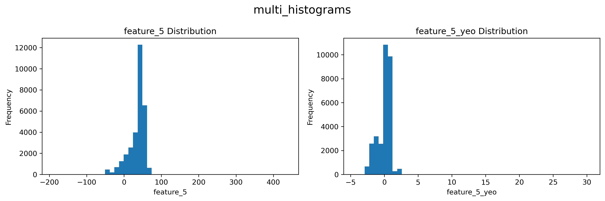

The visualization above demonstrates the structural impact of the preprocessing pipeline, using **Feature 5** as an example. 

* **Before Processing (Left):** The raw distribution exhibited a pronounced negative skew with a heavy left tail and wide-ranging variance. Leaving this unhandled can introduce severe numerical instability and destabilize gradient descent during model training.
* **After Processing (Right):** By applying a **Yeo-Johnson transformation** paired with **Robust Scaling**, the distribution is successfully normalized and centered. The variance is now stabilized and compressed, ensuring optimal convergence for the deep learning pipeline while safely preserving the relative structural integrity of valid minority outliers.

# <h1 align="center">Training Techniques</h1>

## Model Verification

Before starting the full training process, it is useful to verify that both the forward and backward paths of the model are working correctly. These checks can detect implementation and configuration problems early, before spending time on a full training run.

### Step 1: Check the Forward Path

The first step is to pass a batch of data through the model before starting training.

This helps verify that:

- The data produced by the DataLoader has the expected shape and type.
- The input dimensions of the model match the dimensions of the data.
- The model produces outputs with the expected shape.
- The outputs are compatible with the selected loss function and target labels.
- The complete forward computation can be executed without errors.

This check is useful because many problems, such as incorrect input dimensions, incompatible tensor shapes, or incorrect target/output configurations, can be detected before training begins.

The initial loss can also be calculated at this stage. Although this value does not by itself indicate whether the model is performing well, it provides a useful baseline for observing how the loss changes during training.

### Step 2: Check the Backward Path

The second step is to verify that the model can actually learn from the data. A common approach is to select a very small subset of the training data, such as a few batches, and intentionally try to overfit the model on this subset.

The purpose is to check whether the complete training loop is working correctly:

- The loss can be backpropagated successfully.
- Gradients are being computed correctly.
- The optimizer is updating the model parameters.
- The loss decreases when the model repeatedly sees the same small dataset.
- The model and training configuration have enough capacity to fit the selected examples.

If the model cannot significantly reduce the loss or achieve a very high performance on a small dataset after sufficient training, this is a warning sign that something may be wrong with the implementation or training configuration.

Possible causes include incorrect gradients, an unsuitable learning rate, an inappropriate loss function, incorrect target labels, preprocessing problems, optimizer issues, or insufficient model capacity.

Therefore, failure to overfit a small subset should not immediately be interpreted as a lack of model capacity. The purpose of this experiment is primarily to determine whether the model and training pipeline are capable of learning the data at all.

Once the forward and backward paths have been verified, the model can be trained on the complete dataset with greater confidence.

## Learning Rate Selection

To select a suitable learning rate for the Shuttle classification model, several learning rates were tested using **SGD with a weight decay of `1e-4`**.

The tested learning rates were `0.1`, `0.01`, `0.001`, and `0.0001`. Each configuration was trained for **5 epochs** using the training set.

The results after 5 epochs were:

| Learning Rate | Accuracy | Loss |
|---:|---:|---:|
| `0.1` | `42.63%` | `0.0549` |
| `0.01` | `39.09%` | `0.2371` |
| `0.001` | `14.29%` | `1.1685` |
| `0.0001` | `14.13%` | `1.8784` |

The learning rate **`0.1` performed best in this experiment**, achieving the highest accuracy (`42.63%`) and the lowest loss (`0.0549`) after 5 epochs.

The learning rate `0.01` also showed substantial improvement, but its final loss was higher and its accuracy was lower. The learning rates `0.001` and `0.0001` resulted in significantly poorer performance within the 5-epoch training period.

> **Note:** The exact results may vary between runs due to random model initialization and other sources of training stochasticity. The values above represent the results of this particular experiment.

## Small Grid

After selecting `0.1` as the best learning rate in the **Learning Rate Selection** experiment, a small grid search was performed to investigate learning rates around and above `0.1`.

Since `0.01` performed considerably worse than `0.1`, there was little reason to investigate values below `0.1`, such as `0.05`. Instead, the search focused on larger learning rates: `0.1`, `0.15`, `0.2`, and `0.25`.

For each learning rate, four weight decay values were tested:

- `0.0`
- `1e-4`
- `1e-5`
- `1e-6`

Each configuration was trained for **5 epochs** using SGD.

### Results

| Learning Rate | Weight Decay | Accuracy (%) | Loss |
|---:|---:|---:|---:|
| `0.1` | `0.0` | 43.8798 | 0.1475 |
| `0.1` | `1e-4` | 40.9927 | 0.1391 |
| `0.1` | `1e-5` | 42.1915 | 0.1146 |
| `0.1` | `1e-6` | 41.7575 | 0.1365 |
| `0.15` | `0.0` | 46.0910 | 0.0434 |
| `0.15` | `1e-4` | 49.6471 | 0.0522 |
| `0.15` | `1e-5` | 50.2640 | 0.3924 |
| `0.15` | `1e-6` | 46.1376 | 0.0427 |
| `0.2` | `0.0` | 41.2208 | 0.0822 |
| `0.2` | `1e-4` | 42.6858 | 0.0383 |
| `0.2` | `1e-5` | 44.1438 | 0.0726 |
| `0.2` | `1e-6` | 41.8024 | 0.0804 |
| `0.25` | `0.0` | 47.4075 | 0.0552 |
| `0.25` | `1e-4` | 47.5922 | 0.0764 |
| `0.25` | `1e-5` | 25.3123 | 0.4546 |
| `0.25` | `1e-6` | 42.3518 | 0.1988 |

### Analysis

The results show that increasing the learning rate from `0.1` generally improved the final loss, but the behavior became less stable at higher learning rates.

At **`LR=0.1`**, all four weight decay values produced similar results. The lowest loss was `0.1146` with `weight decay = 1e-5`, although the accuracy remained around `42%`.

At **`LR=0.15`**, the model achieved substantially lower losses with `weight decay = 0.0` and `1e-6`, reaching `0.0434` and `0.0427`, respectively. However, `weight decay = 1e-5` produced a much higher loss of `0.3924` despite achieving the highest accuracy in the grid (`50.2640%`). This suggests that the final accuracy and loss do not always rank configurations in the same order.

At **`LR=0.2`**, the lowest loss in the entire grid was obtained with `weight decay = 1e-4`, reaching `0.0383`. The other weight decay values also produced relatively low losses, making this learning rate reasonably stable across the tested weight decay values.

At **`LR=0.25`**, the results became more unstable. In particular, `weight decay = 1e-5` produced a very high loss of `0.4546` and a significantly lower accuracy of `25.3123%`. This suggests that increasing the learning rate further can make training less stable for some weight decay values.

Based on **final loss**, the best configuration in this experiment was:

**Learning Rate = `0.2`**  
**Weight Decay = `1e-4`**  
**Final Loss = `0.0383`**

This configuration achieved the lowest final loss among all tested combinations while maintaining reasonable accuracy (`42.6858%`).

> **Note:** The results are based on a single 5-epoch run for each configuration. Since neural network training depends on random initialization and other sources of stochasticity, the exact values may vary between runs. The selected configuration should therefore be validated with a longer training run before being considered the final hyperparameter choice.