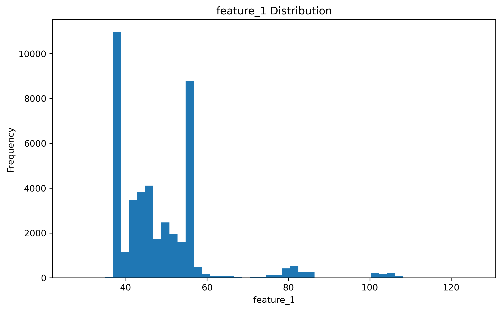
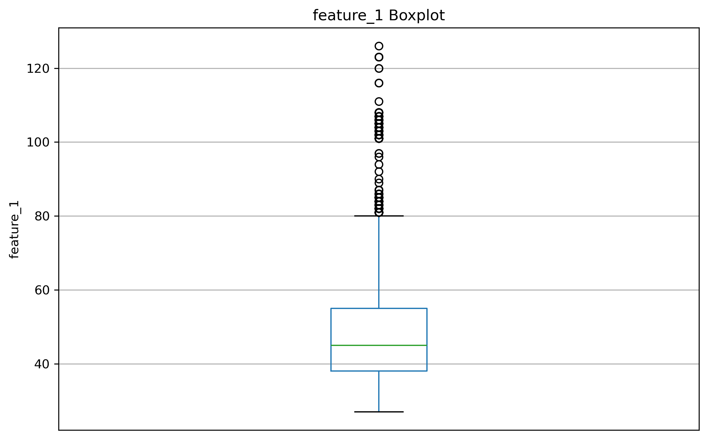
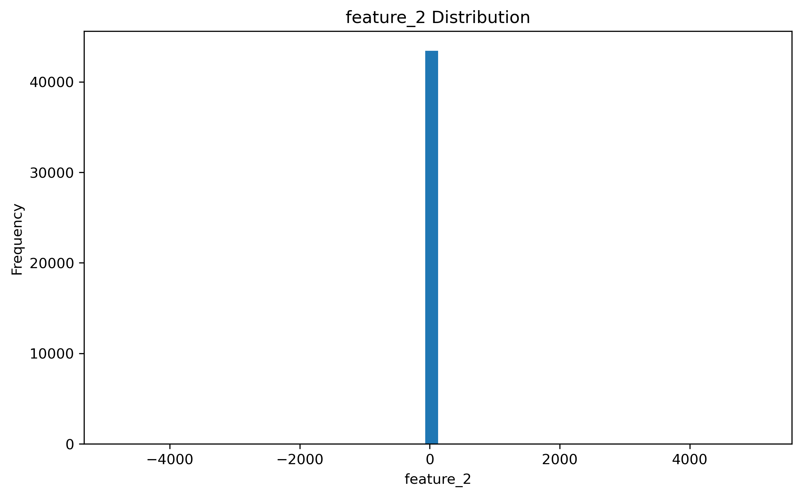
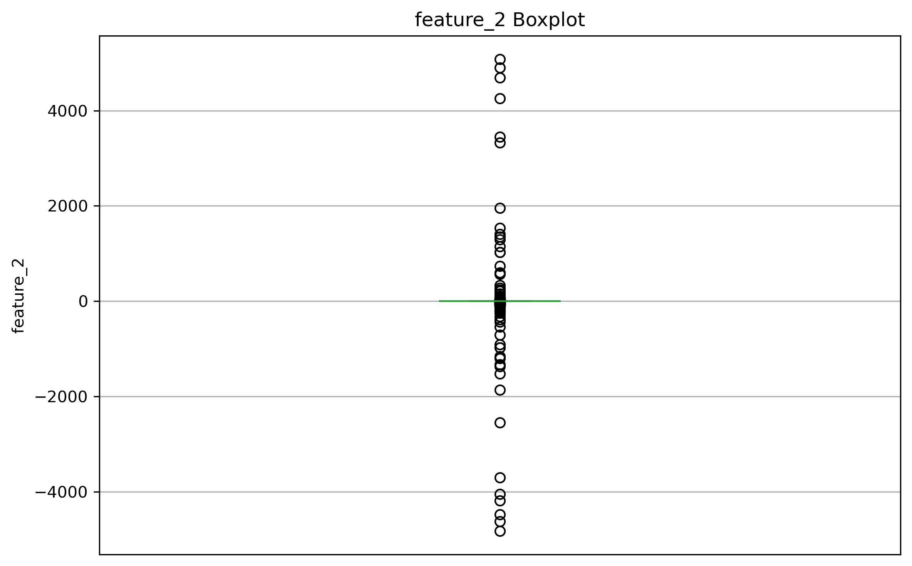
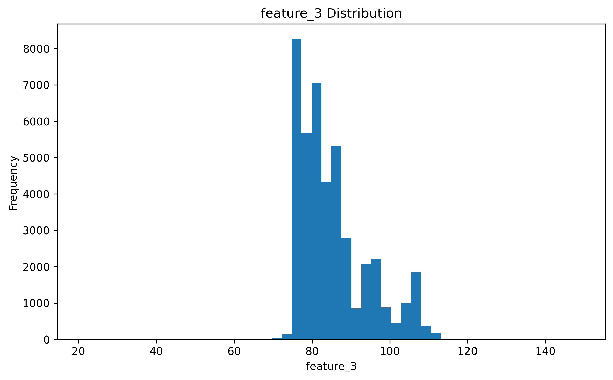
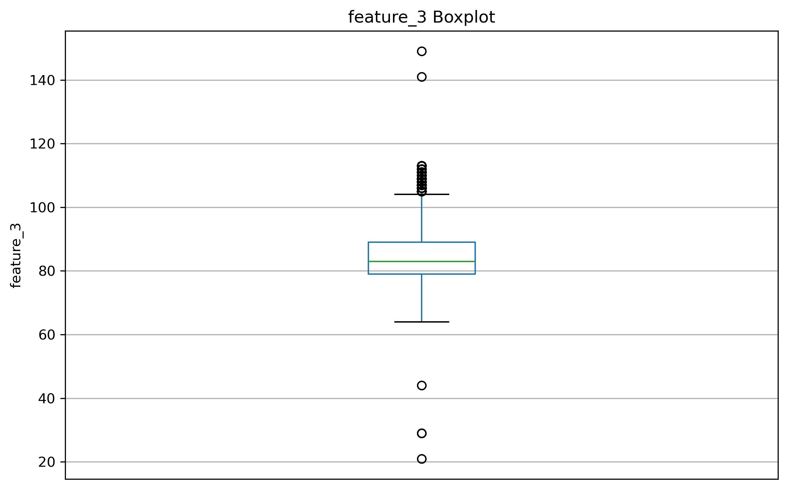
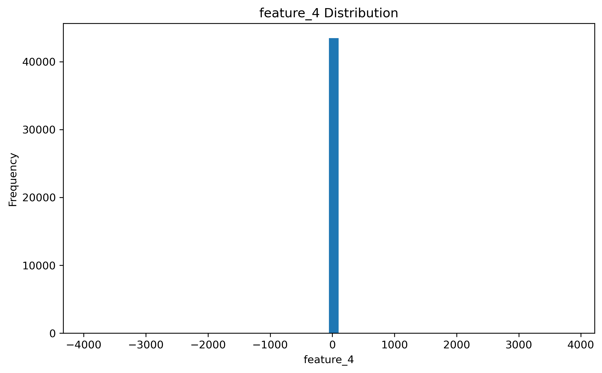
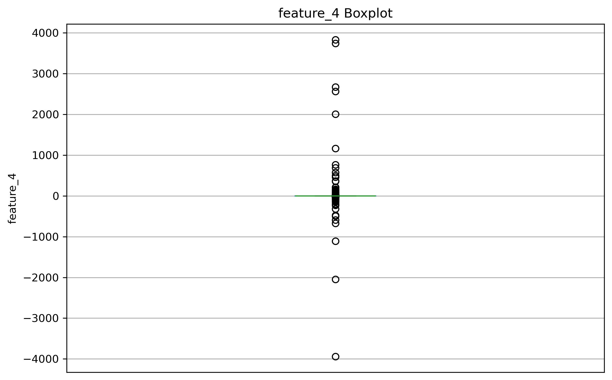

<h1 align="center">Explore Neural Network Training Techniques</h1>

# Project Overview

# Project Structure

# File Descriptions

# Data Analysis and Preparation

## 1. Data Understanding

Initial exploration of the dataset to understand its structure, feature types, data quality aspects, and basic statistical properties. This step establishes a foundational understanding of the data before conducting further analysis, preprocessing, and model development.

### 1.1. Dataset Structure

The dataset used in this project is the **Statlog (Shuttle) dataset**, a multiclass classification dataset derived from NASA space shuttle simulations. It contains numerical measurements describing different shuttle conditions, with the goal of classifying each observation into one of several predefined classes.

🔗 [Statlog (Shuttle) Dataset - UCI Machine Learning Repository](https://archive.ics.uci.edu/dataset/148/statlog)

#### Dataset Information

| Property | Description |
|:---:|:---:|
| Number of instances | 43,500 |
| Number of features | 9 |
| Target variable | Feature 9 |
| Task type | Multiclass Classification |
| Data type | Numerical |

#### Features

The dataset contains nine numerical features representing shuttle sensor measurements. The original dataset does not provide descriptive feature names, so features are referenced by their column indices.

#### Target Variable

| Target | Description |
|:---:|:---:|
| target | Class label representing the shuttle condition |

The target variable contains multiple classes ranging from 1 to 7, making this a multiclass classification problem.

### 1.2. Initial Statistical Insights

#### Feature Statistics

The dataset contains 43,500 observations with 9 numerical features and 1 target variable.

Some features show a wide range of values:

- Feature 2:
  - Mean = -0.21
  - Standard deviation = 78.14
  - Minimum = -4821
  - Maximum = 5075

- Feature 6:
  - Mean = 1.30
  - Standard deviation = 179.49
  - Minimum = -13839
  - Maximum = 13148

- Feature 8:
  - Mean = 50.90
  - Standard deviation = 21.46
  - Minimum = -353
  - Maximum = 270

> #### Key Findings
>
>- Several features have large differences between their minimum, maximum, and mean values, indicating possible extreme observations and the need for further investigation during exploratory data analysis.
>
>- Feature scales vary significantly across the dataset, suggesting that feature normalization or standardization may be beneficial before neural network training.
>
>- The target variable contains multiple classes, requiring multiclass classification techniques.

### 1.3. Data Quality Assessment

The dataset was evaluated for potential data quality issues before further analysis and preprocessing.

#### Missing Values

- Total missing values: 0

#### Duplicate Records

- Total duplicate rows: 0

#### Data Types

- All features are numerical (`int64`)
- No categorical encoding is required.

## 2. Exploratory Data Analysis (EDA)

Comprehensive analysis of feature distributions, relationships, and data patterns to understand underlying structures in the dataset.

### Feature 1 - Histogram

  

### Feature 1 - Boxplot

  

>**Key Observations**
>
>**Asymmetrical Distribution (Skewness):**
The histogram displays a right-skewed distribution featuring prominent density peaks around the values of **38** and **55**. From these high-frequency modes, the distribution extends into a long right tail. Because this pronounced positive skew can destabilize gradient-based optimizers during model training, a distribution transformation would be beneficial. Since the feature appears to contain strictly positive values, I recommend applying a **Log Transformation**. This approach is likely to normalize the distribution and stabilize the variance before the data is passed to my model.
>
>**Extreme Outlier Concentration:**
The boxplot indicates a dense, continuous sequence of extreme outliers starting immediately beyond the upper bound defined by $1.5 \times IQR$ (approximately **80**) and reaching up to **125**. Rather than isolated measurement anomalies, these concentrated points align with the secondary clusters visible in the histogram. Therefore, they appear to represent valid observations that I need to preserve to avoid significant information loss.
>
>**Scaling Recommendation:**
I recommend utilizing a **`RobustScaler`** for this feature. Because the data contains a heavy concentration of valid, extreme outliers, a mean-based approach like `StandardScaler` would be heavily distorted. `RobustScaler` relies on the median and the interquartile range (which sits tightly between **38** and **55**), meaning it is highly likely to scale the feature effectively without squashing the variance of my dominant baseline readings.

### Feature 2 - Histogram

  

### Feature 2 - Boxplot

  

>**Key Observations**
>
>**Asymmetrical Distribution (Skewness):**
The histogram displays an extremely peaked, zero-centered distribution with values spanning into both negative and positive domains. The vast majority of sensor readings are concentrated exactly at zero, with the distribution extending into sparse, heavy tails in both directions. Because this feature contains zero and negative values, a Log Transformation cannot be evaluated. To normalize this heavily leptokurtic distribution and stabilize the variance, I recommend applying a **Yeo-Johnson Transformation**. This approach is a suitable candidate because it safely handles negative numbers and zeros while mitigating the impact of heavy tails on my model.
>
>**Extreme Outlier Concentration:**
The boxplot indicates that the central box is entirely compressed at zero, suggesting the interquartile range (IQR) is extremely narrow or essentially zero. From this resting baseline, a sparse array of extreme outliers radiates symmetrically, extending down to approximately -4500 and up to 5000. Rather than isolated measurement errors, these extreme deviations are likely to represent valid, rare operational states that capture critical minority classes. 
>
>**Scaling Recommendation:**
I recommend utilizing a **`RobustScaler`** for this feature, assuming the underlying implementation can manage a near-zero IQR. Because the data contains massive outliers relative to the dominant zero-cluster, mean-based approaches like `StandardScaler` or boundary-based methods like `MinMaxScaler` would be heavily distorted. `RobustScaler` appears to be the most suitable candidate to handle the extreme valid observations without squashing the variance of my dominant baseline readings.

### Feature 3 - Histogram

  

### Feature 3 - Boxplot

  

>**Key Observations**
>
>**Asymmetrical Distribution (Skewness):**
The histogram displays a moderately right-skewed, multimodal distribution. The bulk of the readings are concentrated between **75** and **90**, with secondary density peaks stretching up toward 110. Because this positive skewness is likely to introduce instability into gradient-based optimizers, a distribution transformation would be beneficial. Since the feature appears to contain strictly positive values (with a minimum observation around 20), I recommend applying a **Log Transformation**. This approach is a suitable candidate to normalize the right-leaning tail and stabilize the variance before feeding the data into my model.
>
>**Extreme Outlier Concentration:**
The boxplot reveals a dense, continuous cluster of upper outliers just beyond the $1.5 \times IQR$ upper bound (between **105** and **115**), which clearly aligns with the secondary peaks in the histogram. Therefore, these appear to represent valid, discrete minority states. However, there are also a few highly isolated extreme outliers located well above the main cluster (near **140** and **150**) and far below it (between **20** and **45**). While the concentrated cluster is highly likely to be valid data, these isolated extremes might require further investigation to rule out measurement anomalies. 
>
>**Scaling Recommendation:**
I recommend utilizing a **`RobustScaler`** for this feature. The presence of both clustered and isolated extreme outliers would pull the mean and artificially inflate the standard deviation, meaning `StandardScaler` would be heavily distorted. By relying on the median and the interquartile range (which cleanly captures the central density between approximately 79 and 89), `RobustScaler` will allow me to scale the baseline data properly while preserving the critical extreme observations.

### Feature 4 - Histogram

  

### Feature 4 - Boxplot

  

>**Key Observations**
>
>**Asymmetrical Distribution (Skewness):**
The histogram reveals a highly peaked, zero-centered distribution with values extending into both the negative and positive domains. The vast majority of observations are concentrated precisely at zero, creating a symmetrical but extremely leptokurtic shape characterized by heavy tails. Because this feature clearly contains zero and negative values, a Log Transformation cannot be utilized. Instead, I recommend applying a **Yeo-Johnson Transformation**. This technique appears to be a suitable candidate for safely handling the negative values while mitigating the impact of the heavy tails and stabilizing the variance before feeding the data into my model.
>
>**Extreme Outlier Concentration:**
The boxplot illustrates that the central box (the interquartile range) is entirely compressed at zero. From this dominant baseline, a sparse array of extreme outliers radiates outward, reaching as low as approximately -4000 and as high as roughly 3900. These extreme deviations appear to be structurally consistent rather than random measurement errors, suggesting they are highly likely to represent valid, rare operational states that I need to retain for accurate minority class representation.
>
>**Scaling Recommendation:**
I recommend utilizing a **`RobustScaler`** for this feature, assuming my underlying implementation can properly manage a near-zero IQR. Because the data contains extreme outliers relative to the massive zero-cluster, mean-based approaches like `StandardScaler` would compute an artificially inflated standard deviation. `RobustScaler` appears to be the most suitable method to accommodate these valid extreme observations without severely squashing the variance of my normal baseline readings.